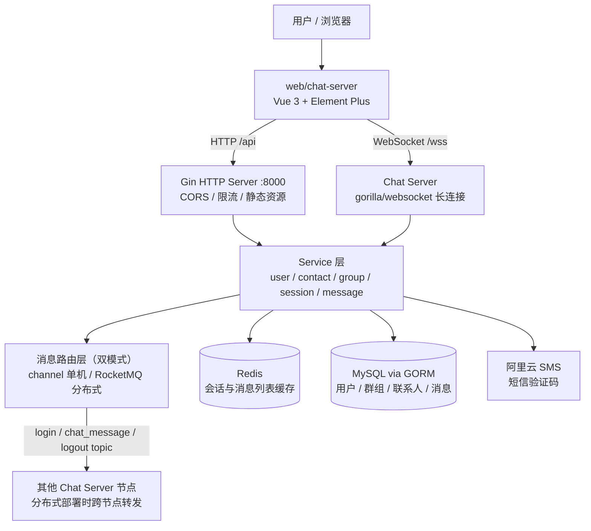

# GoChat - 分布式即时通讯系统

基于 **Go + Vue 3** 前后端分离构建的仿微信即时通讯系统，支持单聊群聊、多种消息类型、语音视频通话与后台管理，通过 RocketMQ 消息路由支持分布式部署，核心链路覆盖消息可靠传输、连接管理与会话缓存。

## 功能特性

- **账号体系**：账号密码注册登录、阿里云短信验证码登录，密码 AES 加密存储
- **联系人体系**：好友申请/通过/拒绝、联系人删除、拉黑与解除拉黑
- **单聊与群聊**：会话创建与管理，消息由服务端转发，支持群成员管理、解散群、多种加群模式
- **多种消息类型**：文本、文件、视频、语音消息的上传下载，头像与静态资源服务
- **语音视频通话**：通话邀请/接受/拒绝/挂断，基于信令的通话状态管理与忙线拒绝
- **实时推送**：WebSocket 长连接，消息经消息队列在多服务节点间路由转发
- **后台管理**：用户禁用/启用/删除、设置管理员、群聊管控
- **稳定性**：静态资源令牌桶限流、Redis 缓存会话与消息列表、channel/RocketMQ 双消息路由模式

## 架构概览



## 技术栈

| 维度 | 技术 | 说明 |
|------|------|------|
| 语言 | Go 1.20+ | 后端开发语言 |
| Web 框架 | Gin | HTTP API + WebSocket（/wss 端点） |
| ORM | GORM + MySQL | 数据建模与自动迁移（6 张核心表） |
| 缓存 | Redis | 消息列表 / 会话缓存 |
| 消息队列 | RocketMQ / channel | **双消息路由模式**：单机部署用 channel 内存通道，分布式部署用 RocketMQ 跨节点转发 |
| 实时通信 | gorilla/websocket | 长连接与消息推送 |
| 日志 | zap + lumberjack | 结构化日志与滚动切分 |
| 安全 | AES + unrolled/secure + 令牌桶 | 密码加密、HTTPS 安全头、IP 限流 |
| 短信 | 阿里云 dysmsapi | 验证码登录 |
| 前端 | Vue 3 + Vuex + Vue Router + Element Plus | 前端 SPA，Axios 请求 |

## 快速开始

### 1. 准备环境

- Go 1.20+
- Node.js 16+
- MySQL 8.0（创建数据库 `kamachat`，表结构由 GORM 启动时自动迁移）
- Redis
- RocketMQ（可选：单机体验可直接用 `channel` 模式，无需部署 MQ）

### 2. 修改配置

编辑 `configs/config.toml`：

```toml
[mysqlConfig]
host = "127.0.0.1"
port = 3306
user = "root"
password = "你的密码"
databaseName = "kamachat"

[redisConfig]
host = "127.0.0.1"
port = 6379

[messageQueueConfig]
messageMode = "channel"   # 单机体验用 channel；分布式部署改 rocketmq
hostPort = "127.0.0.1:9876"  # RocketMQ NameServer 地址

[authCodeConfig]
accessKeyID = "阿里云 accessKeyID"       # 不需要短信登录可留空占位
accessKeySecret = "阿里云 accessKeySecret"
```

### 3. 启动后端

```bash
go mod tidy
go run cmd/kama_chat_server/main.go
# 服务监听 :8000，HTTP API 与 WebSocket(/wss) 同端口
# 首次启动 GORM 自动建表：user_info / group_info / user_contact / session / contact_apply / message
```

### 4. 启动前端

```bash
cd web/chat-server
npm install
npm run serve
# 本地开发默认端口见 vue.config.js 的 devServer 配置
```

浏览器访问前端地址，注册账号登录即可使用。

## 常用命令

```bash
# 后端编译
go build -o kama_chat_backend cmd/kama_chat_server/main.go

# 前端构建生产包
cd web/chat-server && npm run build

# 后端测试
go test ./...
```

## 目录结构

```
KamaChat/
├── cmd/kama_chat_server/    # 后端启动入口
├── configs/                 # 配置文件（config.toml）
├── api/v1/                  # Controller 层（请求解析与响应封装）
├── internal/
│   ├── https_server/        # Gin 路由注册、CORS、令牌桶限流中间件
│   ├── service/             # 业务层
│   │   ├── gorm/            # 用户 / 群组 / 联系人 / 会话 / 消息服务
│   │   ├── chat/            # WebSocket 服务与消息路由
│   │   ├── redis/           # Redis 缓存
│   │   ├── mq/              # RocketMQ 生产者与消费者
│   │   ├── sms/             # 阿里云短信
│   │   └── aes/             # AES 加解密
│   ├── model/               # GORM 数据模型（6 张表）
│   ├── dao/                 # 数据库连接与自动迁移
│   ├── dto/                 # 请求 / 响应 DTO
│   └── config/              # 配置加载
├── pkg/                     # 工具包（zlog / constants / enum / ssl / util）
├── test/                    # 测试
└── web/chat-server/         # Vue 3 前端
```

## 配置重点

| 配置段 | 作用 |
|--------|------|
| `mainConfig` | 服务监听地址与端口（默认 :8000） |
| `mysqlConfig` / `redisConfig` | 数据库与缓存连接 |
| `messageQueueConfig` | **`messageMode` 决定消息路由模式**：`channel`（单机内存通道）/ `rocketmq`（分布式转发）；RocketMQ 模式下配置 NameServer、消费组与 login/chat/logout 三个 topic |
| `authCodeConfig` | 阿里云短信签名与模板（短信登录） |
| `staticSrcConfig` | 头像与文件静态资源目录 |
| `logConfig` | 日志路径（zap + lumberjack 滚动） |

## 常见问题

1. **消息模式怎么选？** 单机跑通功能用 `channel`，零依赖；要验证分布式转发或多节点部署再切 `rocketmq`，两种模式代码路径统一，切换只改配置。
2. **不需要短信登录能跑吗？** 能。短信仅用于验证码登录，账号密码登录不受影响，`authCodeConfig` 留占位即可。
3. **WebSocket 连接地址？** 与 HTTP 同端口，端点为 `/wss`，前端登录后建立长连接。
4. **静态资源访问限流？** `/static` 路由组挂载了基于 IP 的令牌桶限流中间件，下载大文件不会被刷爆带宽。
